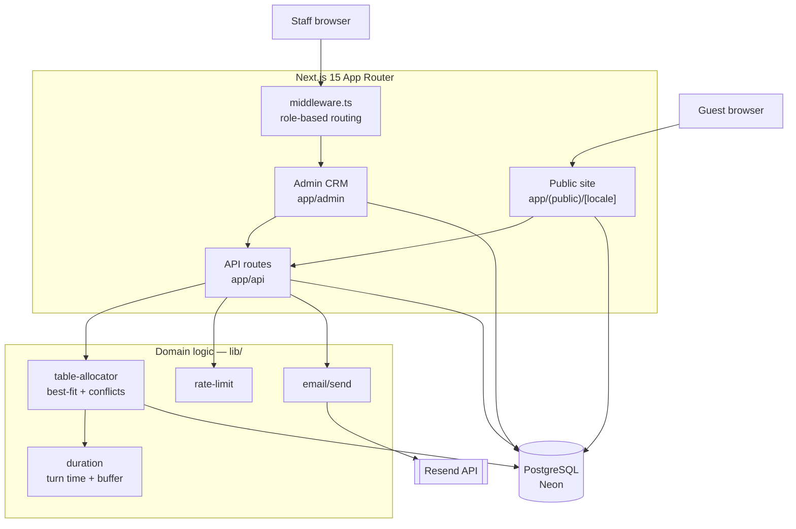

# Restaurant CRM

Reservation management system and multilingual public website for a single restaurant in Austria. Replaces third-party booking platforms (Quandoo, OpenTable) with a self-hosted alternative that keeps guest data in-house.

Built as a production system for a real restaurant, not a demo.

---

## Overview

The application has two distinct surfaces sharing one database and one codebase:

**Admin CRM** (`/admin/*`) — staff-facing. Reservation management, a visual floor plan with live table occupancy, table configuration, menu and allergen management, promotions, gallery, working hours, user management. Interface is available in Ukrainian, German and English.

**Public website** (`/de`, `/en`, `/ua`) — guest-facing. Landing page, menu with EU allergen declarations, promotions, gallery, legal pages (Impressum / Datenschutz, required under Austrian law), and a self-service booking form.

The two surfaces have different defaults by design: staff work in Ukrainian, guests see German first.

### The core problem

Assigning a table to a booking is not a lookup — it is an allocation problem. A reservation needs the *smallest table that fits*, because seating two guests at a six-top wastes capacity for the whole evening. It must not collide with adjacent bookings, and tables need a cleaning buffer between sittings. That logic lives in `lib/booking/table-allocator.ts` and is shared by the admin form, the public booking form, and the availability endpoint — one implementation, three consumers.

---

## Key Features

**Reservations**
- Table assignment via a best-fit allocator with configurable turn durations and a cleaning buffer
- Conflict detection across adjacent bookings, buffer-aware
- Four sources tracked separately: website, phone, walk-in, admin
- Six-state status lifecycle (pending → confirmed → seated → completed, plus cancelled / no-show)

**Floor plan**
- Live occupancy view with tables positioned on a percentage-based coordinate grid
- Walk-in seating directly from the floor plan

**Menu**
- Three-language content per dish and category, with German as the required fallback
- All 14 EU-mandated allergen classes as a typed enum, surfaced on the public menu
- Single price or multiple priced variants per dish
- Dietary flags and spice level

**Public booking**
- Availability computed from working hours, turn duration and live table occupancy
- Layered bot mitigation: IP rate limiting, honeypot field, minimum form-fill time
- Server forces `source` and `status` regardless of what the client sends

**Transactional email**
- Confirmation, reminder and cancellation emails in three languages
- React Email templates, rendered to both HTML and plain text
- All timestamps pinned to `Europe/Vienna` regardless of where the function executes

**Internationalization**
- German, English, Ukrainian across UI strings and database content
- Ukrainian is served at `/ua` while the codebase and database consistently use the ISO code `uk`

---

## Tech Stack

| Layer | Technology | Purpose |
| --- | --- | --- |
| Framework | Next.js 15.5 (App Router) | Server Components, routing, API routes |
| Language | TypeScript 5.6 (`strict`) | Type safety across client, server and DB layer |
| UI | React 18.3, Tailwind CSS 3.4 | No component library — all UI is hand-written |
| Database | PostgreSQL (Neon, Frankfurt) | Primary datastore |
| ORM | Prisma 5.22 | Schema as single source of truth, generated client |
| Auth | NextAuth.js 4.24 | Credentials provider, JWT sessions, `bcryptjs` hashing |
| Validation | Zod 3.23 | Request body validation on every mutating endpoint |
| i18n | next-intl 3.26 | UI message catalogs and locale resolution |
| Email | Resend 4.0 + React Email | Transactional email, templates as React components |
| Dates | `date-fns`, `Intl.DateTimeFormat` | Formatting, with explicit timezone anchoring |
| Hosting | Vercel | Deploys automatically from `main` |

No AI services, no external APIs beyond Resend, no analytics or tracking SDKs.

---

## Architecture



### Authorization model

Access control is enforced at two independent layers.

`middleware.ts` gates the admin route tree. It requires a valid JWT for every `/admin/*` path in its matcher, restricts `STAFF` to reservations and the floor plan only, and restricts `/admin/users` to `OWNER`.

Each admin page additionally wraps itself in `ProtectedAdminPage`, a Server Component that re-checks the session server-side and loads the user's stored locale. The admin `layout.tsx` deliberately contains no auth check — placing one there produced a redirect loop against the login page, which lives inside the same segment.

Route handlers under `/api` validate sessions independently rather than trusting the middleware, since middleware matchers cover page routes only.

### Data flow: a public booking

1. Guest selects a date; `/api/availability` derives candidate slots from `WorkingHours` and probes the allocator for each.
2. Guest submits the form. `/api/public/reservations` applies IP rate limiting, rejects requests that tripped the honeypot or were submitted implausibly fast, then validates with Zod.
3. `findBestTable()` orders active tables by `capacity asc, name asc`, filters by `minCapacity`/`capacity` against party size, and returns the first table with no buffer-aware conflict in a ±4h window around the requested slot.
4. The reservation is persisted with `source` and `status` set server-side, and the guest's locale stored on the row.
5. A confirmation email is dispatched in that locale and `confirmationSentAt` is stamped, making the send idempotent.

### Timezone handling

Vercel Functions default to a US region. `date-fns` `format()` uses the runtime's local timezone, which caused emails to render bookings one calendar day early. All guest-facing date and time formatting now goes through `Intl.DateTimeFormat` with `timeZone: 'Europe/Vienna'` pinned explicitly, and reads from `startTime` rather than the `@db.Date` column, since the latter is midnight UTC of the booking day and is host-timezone sensitive.

---

## Project Structure

```text
restaurant-crm-final/
├── app/
│   ├── (public)/[locale]/       # Guest site — /de /en /ua
│   │   ├── page.tsx             # Landing
│   │   ├── menu/[category]/
│   │   ├── promotions/[slug]/
│   │   ├── gallery/
│   │   ├── booking/success/
│   │   ├── impressum/           # Austrian legal disclosure
│   │   └── datenschutz/         # Privacy policy
│   ├── admin/                   # Staff CRM
│   │   ├── reservations/  floor-plan/  tables/
│   │   ├── menu/          promotions/  gallery/
│   │   └── settings/      users/       profile/
│   └── api/                     # 30 route handlers
│       ├── public/reservations/ # Unauthenticated, rate-limited
│       ├── cron/reminders/      # CRON_SECRET protected
│       └── availability/  floor-status/  settings/  users/ ...
├── components/
│   ├── admin/                   # AdminShell, ProtectedAdminPage, feature clients
│   └── public/                  # Hero, MenuItemCard, PublicBookingForm, ...
├── lib/
│   ├── booking/                 # table-allocator, duration, settings
│   ├── email/                   # Resend client, send logic, React Email templates
│   ├── menu/                    # allergen codes, DE-fallback content pickers
│   ├── public/                  # locale resolution, opening hours, Vienna time
│   └── rate-limit.ts
├── i18n/                        # Locale config and next-intl request setup
├── messages/                    # de.json, en.json, uk.json
├── prisma/                      # schema.prisma, seed.ts
└── middleware.ts
```

`lib/` holds framework-independent domain logic — the allocator, duration rules and email composition contain no Next.js imports and are consumed identically by admin and public routes.

---

## Data Model

15 Prisma models, 5 enums. The domain core:

- **`Table`** — capacity range (`minCapacity`/`capacity`), zone, and `posX`/`posY` as percentages for floor-plan rendering
- **`Reservation`** — separates `endTime` (guest departs) from the buffer window used for allocation; carries `locale` for email language and `confirmationSentAt`/`reminderSentAt` for send idempotency. Indexed on `date`, `status`, and the composite `[tableId, startTime, endTime]` that the conflict query walks.
- **`MenuItem`** — nullable `price` when priced variants exist instead; `allergens Allergen[]` as a native Postgres enum array
- **`Promotion`** — `daysOfWeek Int[]` plus optional time window, so a weekday lunch offer is expressible without a separate schedule table
- **`Setting`** / **`Contact`** — key/value stores for runtime-editable configuration and restaurant contact details

Multilingual content follows a consistent shape: `nameDE` is required, `nameEN`/`nameUK` are nullable, and helper functions in `lib/menu/i18n.ts` resolve with a German fallback.

---

## Getting Started

### Prerequisites

- Node.js 18.17+
- A PostgreSQL database (Neon, Supabase, or local)
- A [Resend](https://resend.com) account, if you want email delivery

### Installation

```bash
git clone https://github.com/IvanSytnik/restaurant-crm.git
cd restaurant-crm
npm install
```

`npm install` triggers `postinstall: prisma generate`, so the Prisma client is generated automatically.

### Environment

```bash
cp .env.example .env
```

| Variable | Required | Description |
| --- | ---: | --- |
| `DATABASE_URL` | Yes | PostgreSQL connection string, `?sslmode=require` for hosted providers |
| `NEXTAUTH_SECRET` | Yes | JWT signing secret, 32+ random bytes |
| `NEXTAUTH_URL` | Yes | Base URL. `http://localhost:3000` locally, deployment URL in production. Also used as the website link in emails. |
| `OWNER_EMAIL` | No | Seed owner account. Defaults to `owner@restaurant.at` |
| `OWNER_PASSWORD` | No | Seed owner password. Defaults to `changeme123` — change after first login |
| `RESEND_API_KEY` | No | Enables email. Without it, email calls short-circuit and the app runs normally |
| `RESEND_FROM_EMAIL` | No | Sender address. Falls back to `onboarding@resend.dev` |
| `CRON_SECRET` | No | If set, `/api/cron/reminders` requires `Authorization: Bearer <secret>` |
| `REMINDER_HORIZON_HOURS` | No | How far ahead the reminder job looks. Defaults to `24` |

Generate a secret with:

```bash
node -e "console.log(require('crypto').randomBytes(32).toString('base64'))"
```

### Database setup

```bash
npm run db:push    # Sync schema.prisma to the database
npm run seed       # Owner account, 5 tables, working hours, default settings
```

### Development

```bash
npm run dev        # http://localhost:3000
npm run db:studio  # Prisma Studio at http://localhost:5555
```

Sign in at `/admin/login`. The public site is at `/de`, `/en` or `/ua`.

### Available scripts

| Script | Description |
| --- | --- |
| `npm run dev` | Development server |
| `npm run build` | Production build — run before pushing; Vercel's type checking is stricter than the dev server's |
| `npm run start` | Serve the production build |
| `npm run seed` | Seed baseline data (idempotent, uses `upsert`) |
| `npm run db:push` | Push schema changes to the database |
| `npm run db:studio` | Prisma Studio |

---

## Deployment

Deployed on Vercel with automatic builds from `main`. The build runs `prisma generate` via `postinstall`, then `next build`. `NEXTAUTH_URL` must match the deployment URL exactly or callback redirects break.

`/api/cron/reminders` is written to be invoked on a schedule: it selects reservations starting within `REMINDER_HORIZON_HOURS` that have no `reminderSentAt`, are `CONFIRMED` or `SEATED`, and did not originate as walk-ins. It is idempotent and safe to call repeatedly. The schedule itself is configured outside the repository and is not committed.

---

## Engineering Decisions

**Domain logic isolated from the framework.** The allocator, duration rules and email composition live in `lib/` with no Next.js dependencies. Adding the public booking form required no changes to allocation logic — it imported `findBestTable` and got identical behaviour to the admin path.

**Server-controlled invariants on public input.** `/api/public/reservations` accepts guest details but sets `source` and `status` itself. A client cannot self-assign `source: 'ADMIN'` or pre-confirm anything the server did not decide.

**Rate limiting with acknowledged scope.** `lib/rate-limit.ts` is an in-memory token bucket with periodic eviction. On serverless it is per-instance, not global — deliberately chosen as sufficient to deter casual abuse without adding a Redis dependency for a single-restaurant deployment. Documented in the module itself rather than left as an implicit assumption.

**Idempotent email sends.** `confirmationSentAt` and `reminderSentAt` are stamped on the reservation after a successful send. Retries, duplicate cron invocations and manual re-triggers cannot double-send. Every send path returns a typed reason code (`NO_EMAIL`, `ALREADY_SENT`, `WALKIN_SKIP`, …) instead of a bare boolean, so the cron response is diagnosable.

**Explicit timezone anchoring.** See the Architecture section — a real production bug, fixed by removing an implicit dependency on host locale rather than by patching the symptom.

**Auth at page granularity, not layout.** A layout-level guard in `app/admin/layout.tsx` traps the login page inside its own protected segment. `ProtectedAdminPage` per page avoids this and doubles as the locale loader.

**Sentinel addresses over nullable email.** Phone and walk-in bookings without an email get `${phone}@phone.local`, keeping the column non-nullable. `isRealGuestEmail()` filters them at the single send boundary.

**`db push` over migrations.** A deliberate trade-off for a single-tenant deployment with one operator. See Known Limitations.

---

## Known Limitations

These are real and acknowledged, not hidden.

- **No migration history.** The project uses `prisma db push`; `prisma/migrations/` does not exist. Acceptable for one database with one operator, but it prevents reproducible schema rollout and would need to be established before any second deployment.
- **No test suite.** No unit, integration or E2E tests. The allocator's conflict detection is the highest-value candidate — it is pure, deterministic, and its edge cases (back-to-back bookings, buffer boundaries, `excludeReservationId` during edits) are exactly what regression tests are for.
- **No CI pipeline.** Type checking and build verification happen locally and again on Vercel, but nothing gates a push.
- **No ESLint configuration file.** `eslint` and `eslint-config-next` are installed but unconfigured, so `next lint` is not currently usable.
- **Rate limiting is per-instance.** See Engineering Decisions.
- **Images are URL references only.** No upload pipeline; menu and gallery images are external URLs, and there is no validation that a URL points at an image. `next/image` is not used, since the domains are arbitrary.
- **Floor plan polls rather than streams.** Occupancy refreshes on an interval. Adequate for a handful of tables; SSE would be the correct fix at scale.
- **Ordering uses arrow buttons.** Menu and gallery items reorder via up/down controls rather than drag-and-drop.

---

## Roadmap

- Unit tests for the allocator, covering conflict boundaries and buffer arithmetic
- Prisma migration history in place of `db push`
- Per-table QR menu pages
- Image uploads via Vercel Blob
- Analytics: table utilisation, peak hours, source breakdown
- Drag-and-drop ordering for menu and gallery

---

## License

Not currently licensed for reuse. All rights reserved.
